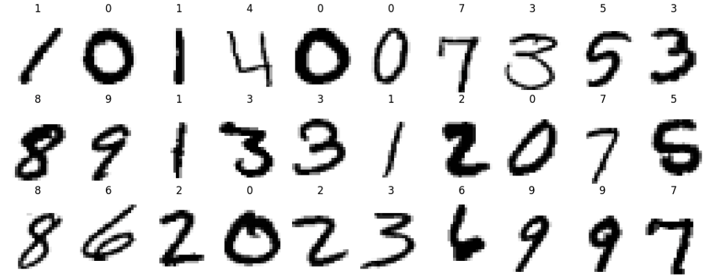
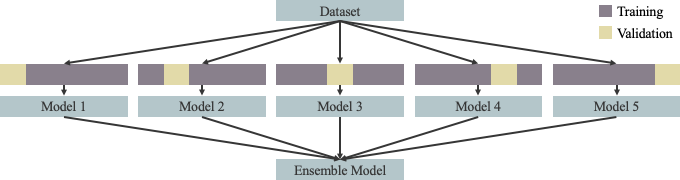
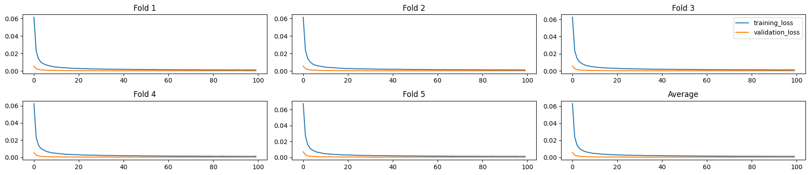

# Digit Recognizer using PyTorch and KFold

## Introduction

Convolutional Neural Networks (CNNs) have become the standard for tasks involving image recognition because of their ability to automatically detect important features in visual data. They are widely used in applications such as object detection, facial recognition, and self-driving cars. 

Starting with the most fundamental task of digit recognition using the MNIST dataset which is considered as the "Hello World" dataset of computer vision, this project aims to develop a strong understanding of CNNs in preparation for more complex image recognition tasks in the future. 

Achieved the 84th on Kaggle! 

## Rundown

### Import Datasets

The datasets are downloaded from the [Digit Recognizer](https://www.kaggle.com/competitions/digit-recognizer/data) competition on Kaggle. 

```
train = pd.read_csv('digit-recognizer/train.csv')
test = pd.read_csv('digit-recognizer/test.csv')
```

### Dataset and Data Loader

> The `Dataset` and `DataLoader` classes encapsulate the process of pulling your data from storage and exposing it to your training loop in batches.
> 
> The `Dataset` is responsible for accessing and processing single instances of data.
> 
> The `DataLoader` pulls instances of data from the Dataset (either automatically or with a sampler that you define), collects them in batches, and returns them for consumption by your training loop. The DataLoader works with all kinds of datasets, regardless of the type of data they contain.

Define 2 Dataset classes, transformations, and normalizations. 
```
class TrainDataset(Dataset):
    def __init__(self, dataframe, transform=None):
        self.labels = dataframe.iloc[:, 0].values
        self.features = dataframe.iloc[:, 1:].values
        self.transform = transform

    def __len__(self):
        return len(self.labels)

    def __getitem__(self, index):
        feature = self.features[index].reshape(28, 28).astype(np.uint8)
        label = self.labels[index]
        if self.transform:
            feature = self.transform(feature)
        return feature, label

class TestDataset(Dataset):
    def __init__(self, dataframe, transform=None):
        self.features = dataframe.values
        self.transform = transform

    def __len__(self):
        return len(self.features)

    def __getitem__(self, index):
        feature = self.features[index].reshape(28, 28).astype(np.uint8)
        if self.transform:
            feature = self.transform(feature)
        return feature

train_mean = train.drop('label', axis=1).values.mean()/255
train_std = train.drop('label', axis=1).values.std()/255

train_transform = transforms.Compose([
    transforms.ToPILImage(),
    transforms.RandomRotation(5),
    transforms.RandomAffine(degrees=5, translate=(0.1, 0.1), scale=(0.9, 1.1)),
    transforms.RandomPerspective(distortion_scale=0.1, p=0.25),
    transforms.ToTensor(),
    transforms.Normalize(train_mean, train_std)
])

test_transform = transforms.Compose([
    transforms.ToPILImage(),
    transforms.ToTensor(),
    transforms.Normalize(train_mean, train_std)
])
```

The training set and testing set are ready. 
```
training_set = TrainDataset(train, transform=train_transform)
testing_set = TestDataset(test, transform=test_transform)
```

Note that the data transformation or augmentation as implemented here does **not** create new data permanently in the dataset. Instead, it applies the transformations **on-the-fly** during training. Each time a batch of data is requested from the `DataLoader`, the transformations are applied to that batch dynamically. They don't take up additional memory or storage. 

### Visualization

Visualize the data as a sanity check. 
```
plt.figure(figsize=(15, 6))
for i in range(30):  
    plt.subplot(3, 10, i+1)
    plt.imshow(training_set.features[i].reshape((28, 28)), cmap=plt.cm.binary)
    plt.title(training_set.labels[i])
    plt.axis('off')
plt.subplots_adjust(wspace=-0.1, hspace=-0.1)
plt.show()
```

<p align="center">
  
</p>

### The Model

Below is the neural network. 
```
class Net(nn.Module):
    def __init__(self):
        super(Net, self).__init__()
        
        self.conv1 = nn.Sequential(
            nn.Conv2d(1, 32, 3, padding=1),
            nn.ReLU(),
            nn.BatchNorm2d(32),
            nn.Conv2d(32, 32, 3, stride=2, padding=1),
            nn.ReLU(),
            nn.BatchNorm2d(32),
            nn.MaxPool2d(2, 2),
            nn.Dropout(0.25)
        )
        
        self.conv2 = nn.Sequential(
            nn.Conv2d(32, 64, 3, padding=1),
            nn.ReLU(),
            nn.BatchNorm2d(64),
            nn.Conv2d(64, 64, 3, stride=2, padding=1),
            nn.ReLU(),
            nn.BatchNorm2d(64),
            nn.MaxPool2d(2, 2),
            nn.Dropout(0.25)
        )
        
        self.conv3 = nn.Sequential(
            nn.Conv2d(64, 128, 3, padding=1),
            nn.ReLU(),
            nn.BatchNorm2d(128),
            nn.MaxPool2d(2, 2),
            nn.Dropout(0.25)
        )
        
        self.fc = nn.Sequential(
            nn.Linear(128, 10),
        )   
        
    def forward(self, x):
        x = self.conv1(x)
        x = self.conv2(x)
        x = self.conv3(x)
        x = x.view(x.size(0), -1)
        return self.fc(x)
```

Below is a function to reset model weights for the `KFold`. 
```
def reset_weights(m):
    for layer in m.children():
        if hasattr(layer, 'reset_parameters'):
            layer.reset_parameters()
```

### Structure

`KFold` from [scikit-learn](https://scikit-learn.org/stable/modules/generated/sklearn.model_selection.KFold.html) is used to avoid overfitting. The training set is shuffled and split into 5 folds, 80% and 20% of which will be used to train and validate the model respectively. 

<p align="center">
  
</p>

### Training

Below are the parameters and variables for the training. 
```
n_splits = 5
batch_size = 100
learning_rate = 0.0001
epochs = 100
loss_fn = nn.CrossEntropyLoss()
training_losses_list, validation_losses_list, validation_accuracies_list = [], [], []
```

I'm using a Mac Studio, so I will use the `mps` device for GPU training acceleration. 
```
device = torch.device('mps')
```

Start training!
```
kf = KFold(n_splits=n_splits, shuffle=True)

for fold, (training_ids, validation_ids) in enumerate(kf.split(training_set)):
    training_sampler = SubsetRandomSampler(training_ids)
    validation_sampler = SubsetRandomSampler(validation_ids)
    training_loader = DataLoader(training_set, batch_size=batch_size, sampler=training_sampler)
    validation_loader = DataLoader(training_set, batch_size=batch_size, sampler=validation_sampler)
    
    model = Net().to(device)
    model.apply(reset_weights)
    optimizer = optim.Adam(model.parameters(), lr=learning_rate)

    training_loss_min = np.inf
    validation_loss_min = np.inf
    training_losses, validation_losses, validation_accuracies = [], [], []
    
    for e in range(epochs):
        model.train()
        training_loss = 0
        for features, labels in training_loader:
            features, labels = features.to(device), labels.to(device)
            optimizer.zero_grad()
            outputs = model(features)
            loss = loss_fn(outputs, labels)
            loss.backward()
            optimizer.step()
            training_loss += loss.item()

        model.eval()
        validation_loss = 0
        correct, total = 0, 0
        for features, labels in validation_loader:
            features, labels = features.to(device), labels.to(device)
            outputs = model(features)
            loss = loss_fn(outputs, labels)
            validation_loss += loss.item()
            _, predicted = torch.max(outputs.data, 1)
            total += labels.size(0)
            correct += (predicted == labels).sum().item()
        validation_accuracy = correct / total

        training_losses.append(training_loss/total)
        validation_losses.append(validation_loss/total)
        validation_accuracies.append(validation_accuracy)

        network_learned = (training_loss < training_loss_min) & (validation_loss < validation_loss_min)
        if network_learned:
            training_loss_min = training_loss
            validation_loss_min = validation_loss
            torch.save(model.state_dict(), f'model_mnist_{fold+1}.pt')
            print(f'fold {fold+1} | epoch {e+1} | {training_loss/total:.3f} | {validation_loss/total:.3f} | {validation_accuracy:.3f} | network improved')
        else:
            print(f'fold {fold+1} | epoch {e+1} | {training_loss/total:.3f} | {validation_loss/total:.3f} | {validation_accuracy:.3f}')
    
    training_losses_list.append(training_losses)
    validation_losses_list.append(validation_losses)
    validation_accuracies_list.append(validation_accuracies)
```

The best models are saved to local from the following folds and epochs. 
```
fold 1 | epoch 100 | 0.001 | 0.000 | 0.992 | network improved
fold 2 | epoch 94 | 0.001 | 0.000 | 0.993 | network improved
fold 3 | epoch 86 | 0.001 | 0.000 | 0.994 | network improved
fold 4 | epoch 88 | 0.001 | 0.000 | 0.993 | network improved
fold 5 | epoch 97 | 0.001 | 0.000 | 0.992 | network improved
```

Below is the visualization of the training losses and the validation losses. 
```
fig, [[ax1, ax2, ax3], [ax4, ax5, ax6]] = plt.subplots(nrows=2, ncols=3, figsize=(18, 4))

ax1.plot(training_losses_list[0], label='training_loss')
ax1.plot(validation_losses_list[0], label='validation_loss')
ax1.set_title('Fold 1')

ax2.plot(training_losses_list[1], label='training_loss')
ax2.plot(validation_losses_list[1], label='validation_loss')
ax2.set_title('Fold 2')

ax3.plot(training_losses_list[2], label='training_loss')
ax3.plot(validation_losses_list[1], label='validation_loss')
ax3.set_title('Fold 3')

ax4.plot(training_losses_list[3], label='training_loss')
ax4.plot(validation_losses_list[3], label='validation_loss')
ax4.set_title('Fold 4')

ax5.plot(training_losses_list[4], label='training_loss')
ax5.plot(validation_losses_list[4], label='validation_loss')
ax5.set_title('Fold 5')

training_losses_average = [sum(x)/len(x) for x in zip(*training_losses_list)]
validation_losses_average = [sum(x)/len(x) for x in zip(*validation_losses_list)]
ax6.plot(training_losses_average, label='training_loss')
ax6.plot(validation_losses_average, label='validation_loss')
ax6.set_title('Average')

ax3.legend()
plt.tight_layout()
```

<p align="center">
  
</p>

### Ensemble

I ensemble the 5 models saved from training to make the final predictions on the testing set. 
```
models = []
for fold in range(0, 5):
    model = Net().to(device)
    model.load_state_dict(torch.load(f'model_mnist_{fold+1}.pt', weights_only=False))
    model.eval()
    models.append(model)

testing_loader = DataLoader(testing_set, batch_size=len(testing_set), shuffle=False)

pred = np.zeros(280000).reshape(28000, 10)
with torch.no_grad():
    for model in models:
        for features in testing_loader:
            features = features.to(device)
            outputs = model(features)
            pred += 0.2 * outputs.cpu().numpy()

predictions = pd.DataFrame(np.argmax(pred, axis=1), columns=['Label'])
```

Save the predictions to local for submission. 
```
predictions.index += 1
predictions.index.name = 'ImageId'
predictions.to_csv('submission.csv')
```

## Results

The submission achieved an accuracy score of 0.99575, the 84th on the leaderboard at the time of submission. 

<p align="center">
  
</p>