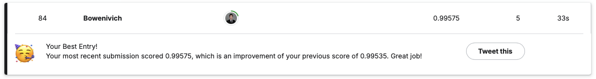

# Digit Recognizer using PyTorch and KFold

## Introduction

Convolutional Neural Networks (CNNs) have become the standard for tasks involving image recognition because of their ability to automatically detect important features in visual data. They are widely used in applications such as object detection, facial recognition, and self-driving cars. 

Starting with the most fundamental task of digit recognition using the MNIST dataset which is considered as the "Hello World" dataset of computer vision, this project aims to develop a strong understanding of CNNs in preparation for more complex image recognition tasks in the future. 

## Rundown

### Import Datasets

The datasets are downloaded from the [Digit Recognizer](https://www.kaggle.com/competitions/digit-recognizer/data) competition on Kaggle. 

```
import pandas as pd

train = pd.read_csv('digit-recognizer/train.csv')
test = pd.read_csv('digit-recognizer/test.csv')
```

### Dataset and Data Loader

> The `Dataset` and `DataLoader` classes encapsulate the process of pulling your data from storage and exposing it to your training loop in batches.
> 
> The `Dataset` is responsible for accessing and processing single instances of data.
> 
> The `DataLoader` pulls instances of data from the Dataset (either automatically or with a sampler that you define), collects them in batches, and returns them for consumption by your training loop. The DataLoader works with all kinds of datasets, regardless of the type of data they contain.

First, define 2 Dataset classes. 
```
from torch.utils.data import Dataset, DataLoader
from torchvision import transforms

class TrainDataset(Dataset):
    def __init__(self, dataframe, transform=None):
        self.labels = dataframe.iloc[:, 0].values
        self.images = dataframe.iloc[:, 1:].values
        self.transform = transform

    def __len__(self):
        return len(self.labels)

    def __getitem__(self, index):
        image = self.images[index].reshape(28, 28).astype(np.uint8)
        label = self.labels[index]
        if self.transform:
            image = self.transform(image)
        
        return image, label

class TestDataset(Dataset):
    def __init__(self, dataframe, transform=None):
        self.images = dataframe.values
        self.transform = transform

    def __len__(self):
        return len(self.images)

    def __getitem__(self, index):
        image = self.images[index].reshape(28, 28).astype(np.uint8)
        if self.transform:
            image = self.transform(image)
        
        return image
```

Second, apply transformations and normalizations. 
```
train_mean = train.drop('label', axis=1).values.mean()/255
train_std = train.drop('label', axis=1).values.std()/255

train_transform = transforms.Compose([
    transforms.ToPILImage(),
    transforms.RandomRotation(5),
    transforms.RandomAffine(degrees=5, translate=(0.1, 0.1), scale=(0.9, 1.1)),
    transforms.RandomPerspective(distortion_scale=0.1, p=0.25),
    transforms.ToTensor(),
    transforms.Normalize(train_mean, train_std)
])

test_transform = transforms.Compose([
    transforms.ToPILImage(),
    transforms.ToTensor(),
    transforms.Normalize(train_mean, train_std)
])

train_data = TrainDataset(train, transform=train_transform)
test_data = TestDataset(test, transform=test_transform)
```

Note that the data transformation or augmentation as implemented here does **not** create new data permanently in the dataset. Instead, it applies the transformations **on-the-fly** during training. Each time a batch of data is requested from the `DataLoader`, the transformations are applied to that batch dynamically. They don't take up additional memory or storage. 

### Visualization

Visualize the data as a sanity check. 
```
import matplotlib.pyplot as plt

plt.figure(figsize=(15, 6))
for i in range(30):  
    plt.subplot(3, 10, i+1)
    plt.imshow(train_data.images[i].reshape((28, 28)), cmap=plt.cm.binary)
    plt.title(train_data.labels[i])
    plt.axis('off')
plt.subplots_adjust(wspace=-0.1, hspace=-0.1)
plt.show()
```

<p align="center">
  
</p>

### The Model

Below is the neural network. 
```
from torch import nn, optim

class Net(nn.Module):
    def __init__(self):
        super(Net, self).__init__()
        
        self.conv1 = nn.Sequential(
            nn.Conv2d(1, 32, 3, padding=1),
            nn.ReLU(),
            nn.BatchNorm2d(32),
            nn.Conv2d(32, 32, 3, stride=2, padding=1),
            nn.ReLU(),
            nn.BatchNorm2d(32),
            nn.MaxPool2d(2, 2),
            nn.Dropout(0.25)
        )
        
        self.conv2 = nn.Sequential(
            nn.Conv2d(32, 64, 3, padding=1),
            nn.ReLU(),
            nn.BatchNorm2d(64),
            nn.Conv2d(64, 64, 3, stride=2, padding=1),
            nn.ReLU(),
            nn.BatchNorm2d(64),
            nn.MaxPool2d(2, 2),
            nn.Dropout(0.25)
        )
        
        self.conv3 = nn.Sequential(
            nn.Conv2d(64, 128, 3, padding=1),
            nn.ReLU(),
            nn.BatchNorm2d(128),
            nn.MaxPool2d(2, 2),
            nn.Dropout(0.25)
        )
        
        self.fc = nn.Sequential(
            nn.Linear(128, 10),
        )   
        
    def forward(self, x):
        x = self.conv1(x)
        x = self.conv2(x)
        x = self.conv3(x)
        x = x.view(x.size(0), -1)
        return self.fc(x)
```

### Structure

`KFold` from [scikit-learn](https://scikit-learn.org/stable/modules/generated/sklearn.model_selection.KFold.html) is used to avoid overfitting. The training dataset is shuffled and split into 5 folds, 80% and 20% of which will be used to train and validate the model respectively. 

<p align="center">
  
</p>

```
from sklearn.model_selection import KFold

n_splits = 5
kf = KFold(n_splits=n_splits, shuffle=True)
```

### Training

I'm using the Mac Studio, so I will use the `mps` device for GPU training acceleration. 
```
import torch
device = torch.device('mps')
```

Start training!
```
import numpy as np
from torch.utils.data.sampler import SubsetRandomSampler

batch_size = 100
learning_rate = 0.001
epochs = 250
running_losses_list, val_losses_list, val_accuracies_list = [], [], []

for fold, (train_ids, val_ids) in enumerate(kf.split(train_data)):
    train_sampler = SubsetRandomSampler(train_ids)
    val_sampler = SubsetRandomSampler(val_ids)
    train_loader = DataLoader(train_data, batch_size=batch_size, sampler=train_sampler)
    val_loader = DataLoader(train_data, batch_size=batch_size, sampler=val_sampler)

    model = Net().to(device)
    optimizer = optim.SGD(model.parameters(), lr=learning_rate)
    loss_fn = nn.CrossEntropyLoss()

    running_loss_min = np.inf
    val_loss_min = np.inf

    running_losses, val_losses, val_accuracies = [], [], []
    
    for e in range(epochs):
        model.train()
        running_loss = 0
        for images, labels in train_loader:
            images, labels = images.to(device), labels.to(device)
            optimizer.zero_grad()
            outputs = model(images)
            loss = loss_fn(outputs, labels)
            loss.backward()
            optimizer.step()
            running_loss += loss.item()
        
        model.eval()
        val_loss = 0
        correct, total = 0, 0
        with torch.no_grad():
            for images, labels in val_loader:
                images, labels = images.to(device), labels.to(device)
                outputs = model(images)
                loss = loss_fn(outputs, labels)
                val_loss += loss.item()
                _, predicted = torch.max(outputs.data, 1)
                total += labels.size(0)
                correct += (predicted == labels).sum().item()
        val_accuracy = correct / total
        
        running_losses.append(running_loss/total)
        val_losses.append(val_loss/total)
        val_accuracies.append(val_accuracy)

        network_learned = (running_loss < running_loss_min) & (val_loss < val_loss_min)
        if network_learned:
            running_loss_min = running_loss
            val_loss_min = val_loss
            torch.save(model.state_dict(), 'model_mnist_' + str(fold+1) + '.pt')
            print(f'fold {fold+1} | epoch {e+1} | {running_loss/total:.3f} | {val_loss/total:.3f} | {val_accuracy:.3f} | network improved')
        else:
            print(f'fold {fold+1} | epoch {e+1} | {running_loss/total:.3f} | {val_loss/total:.3f} | {val_accuracy:.3f}')

    running_losses_list.append(running_losses)
    val_losses_list.append(val_losses)
    val_accuracies_list.append(val_accuracies)
```

The best models are saved to local from the following folds and epochs. 
```
fold 1 | epoch 226 | 0.002 | 0.000 | 0.990 | network improved
fold 2 | epoch 232 | 0.002 | 0.000 | 0.988 | network improved
fold 3 | epoch 221 | 0.003 | 0.000 | 0.989 | network improved
fold 4 | epoch 228 | 0.003 | 0.000 | 0.989 | network improved
fold 5 | epoch 246 | 0.002 | 0.000 | 0.989 | network improved
```

### Ensemble

I ensemble the 5 models saved from training to make the final predictions on the test dataset. 
```
models = []
for i in range(0, 5):
    model = Net().to(device)
    model.load_state_dict(torch.load('model_mnist_' + str(i+1) + '.pt', weights_only=False))
    model.eval()
    models.append(model)

test_loader = DataLoader(test_data, batch_size=len(test_data), shuffle=False)

pred = np.zeros(280000).reshape(28000, 10)
with torch.no_grad():
    for model in models:
        for images in test_loader:
            images = images.to(device)
            outputs = model(images)
            pred += 0.2 * outputs.cpu().numpy()

predictions = pd.DataFrame(np.argmax(pred, axis=1), columns=['Label'])
```

Save the predictions to local for submission. 
```
submission = pd.DataFrame(predictions, columns=['Label'])
submission.index += 1
submission.index.name = 'ImageId'
submission.to_csv('submission.csv')
```

## Results

The submission achieved an accuracy score of 0.99367, the 193th on the leaderboard at the time of submission. 

<p align="center">
  
</p>
